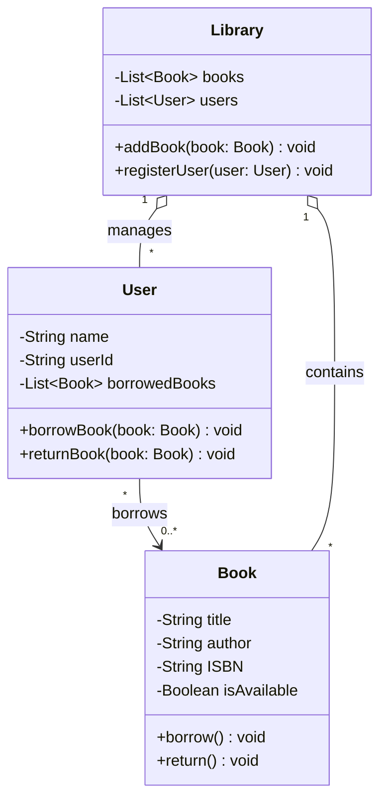
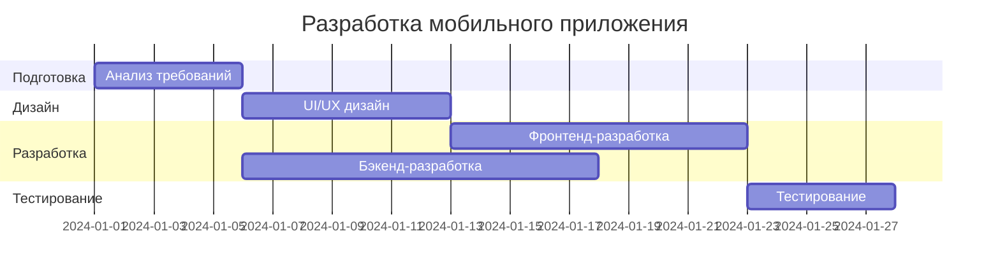
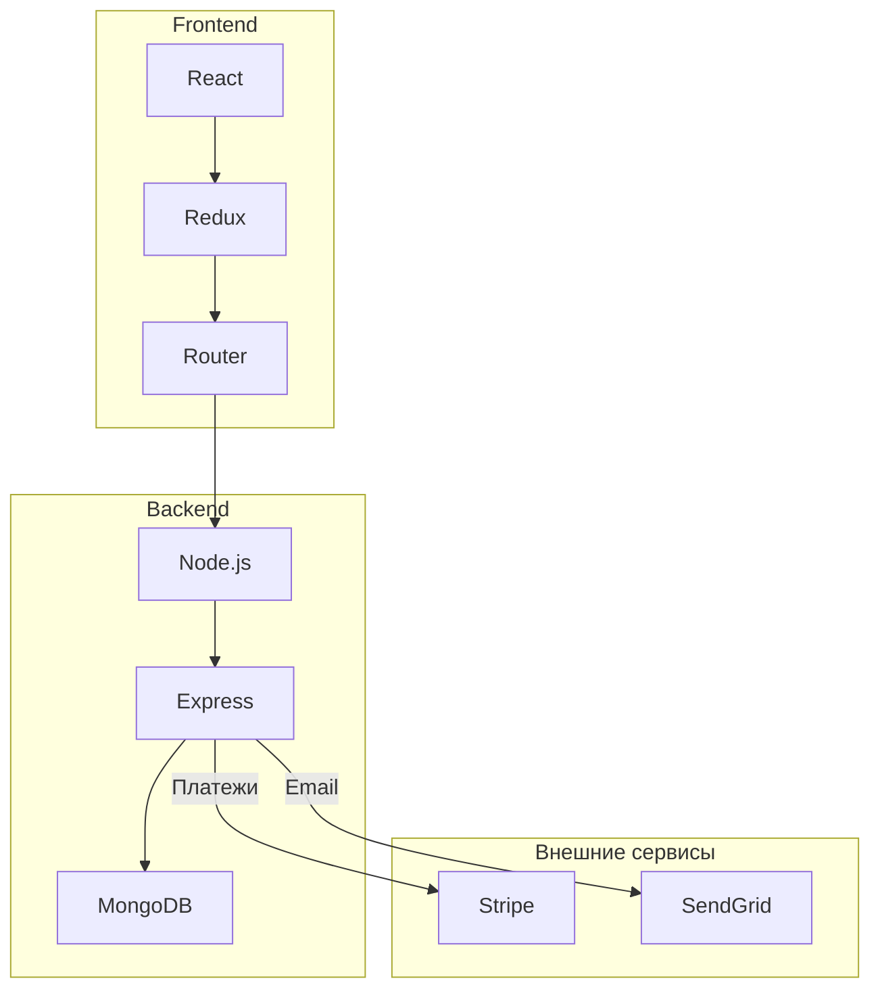
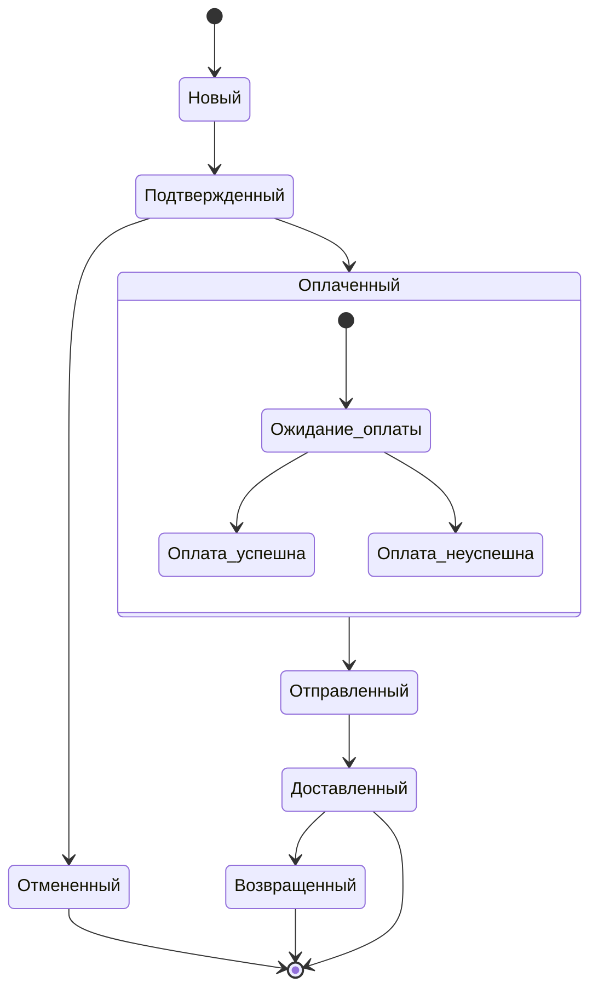
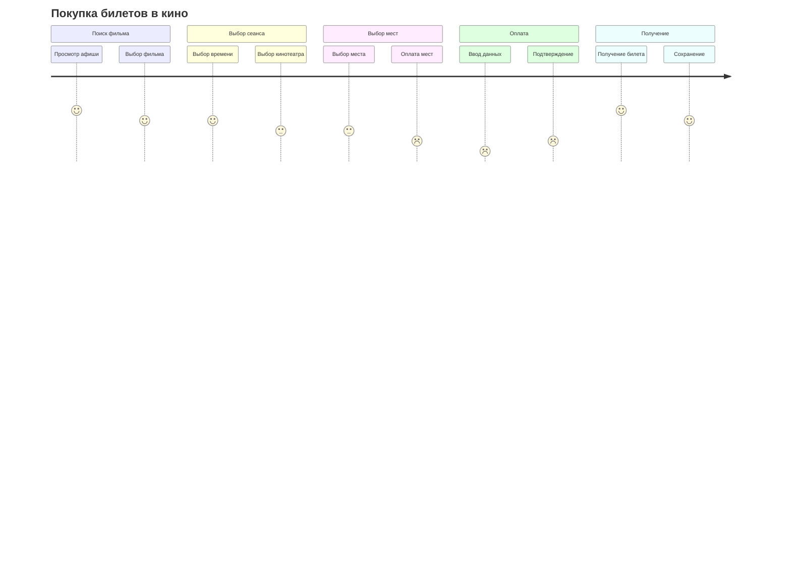
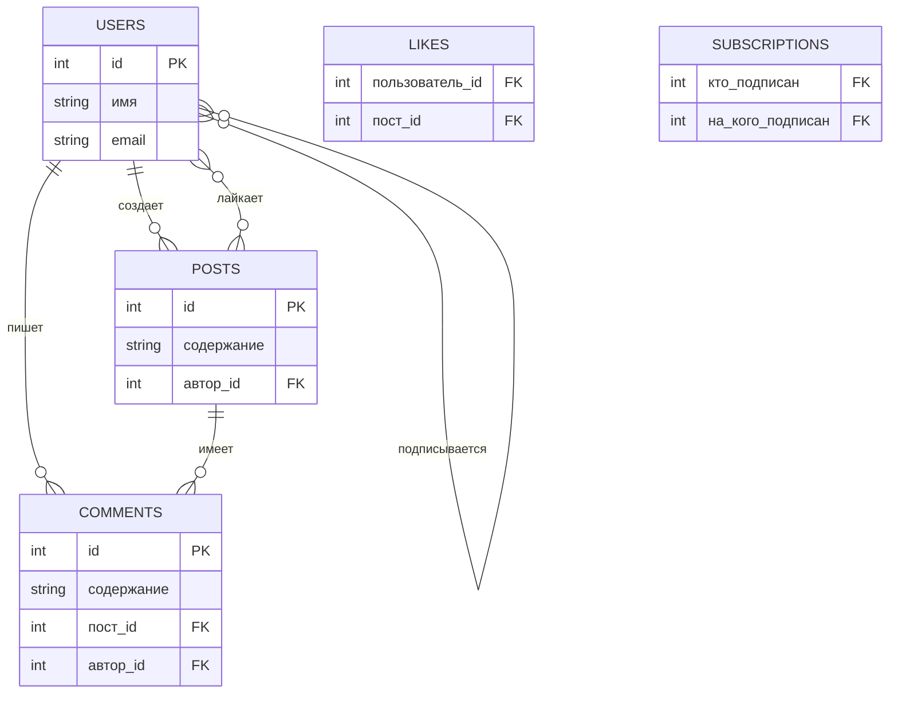
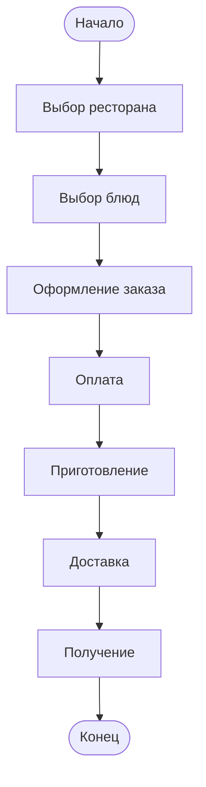
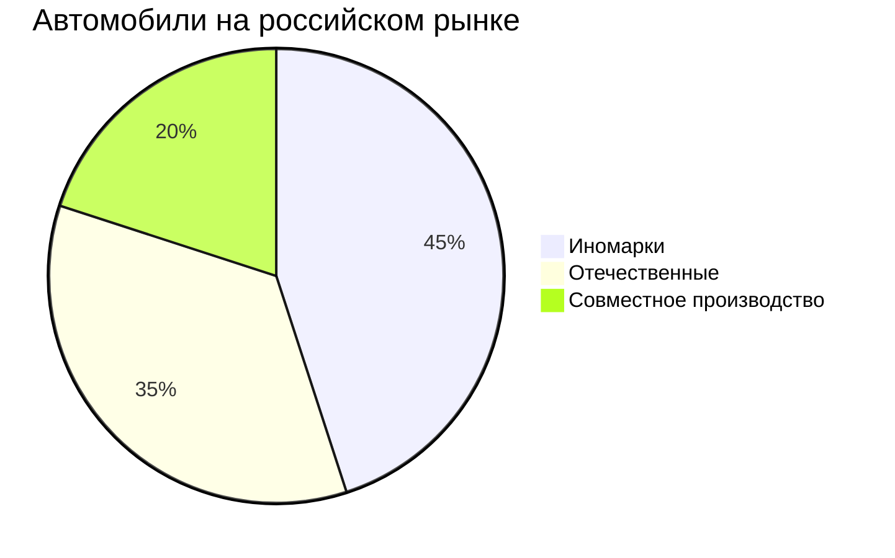

```markdown
### Приготовление чая
```mermaid
flowchart TD
    A([Начало]) --> B[Кипячение воды]
    B --> C{Есть ли чай?}
    C -->|Да| D[Заварить чай]
    C -->|Нет| E[Купить чай]
    E --> D
    D --> F[Пить чай]
    F --> G([Конец])

### Заказ такси
```mermaid
sequenceDiagram
    participant Клиент
    participant Приложение
    participant Сервер
    participant Водитель

    Клиент->>Приложение: Вызывает такси
    activate Приложение
    Приложение->>Сервер: Отправляет запрос
    activate Сервер
    Сервер->>Водитель: Ищет свободного водителя
    activate Водитель
    Водитель->>Сервер: Принимает заказ
    deactivate Водитель
    Сервер->>Приложение: Водитель найден
    deactivate Сервер
    Приложение->>Клиент: Уведомляет клиента
    deactivate Приложение
    Водитель->>Клиент: Забирает клиента
```


### Библиотечная система


### Разработка мобильного приложения

### Веб-приложение


### Заказ в интернет-магазине


### Покупка билетов в кино


### Социальная сеть


### Сервис доставки еды


### Автомобили в России
