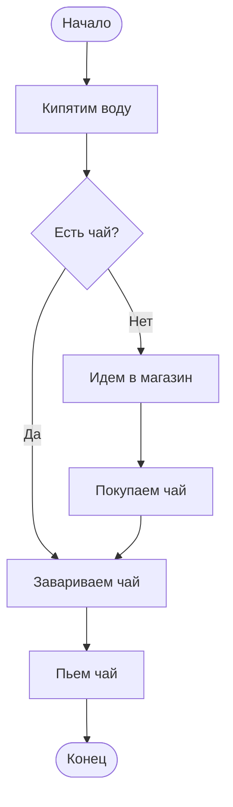
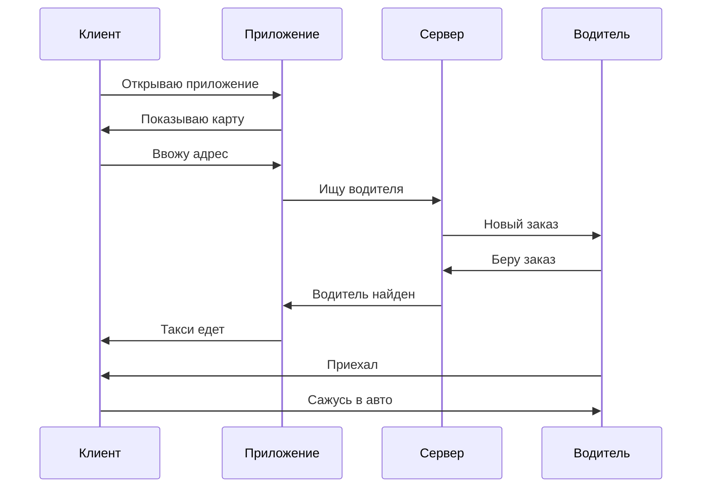
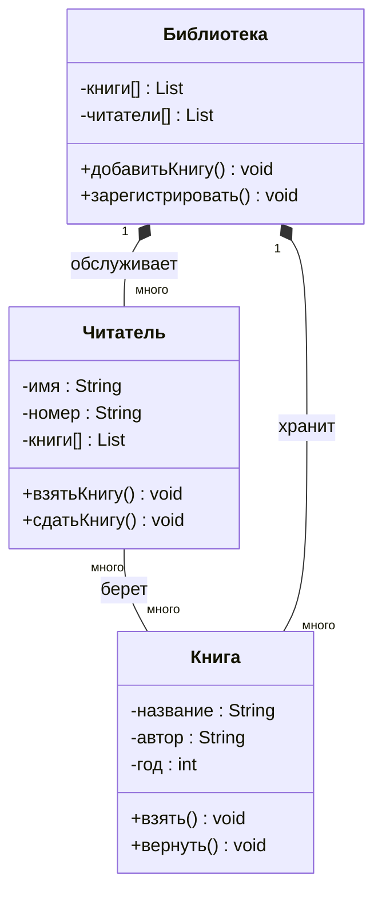
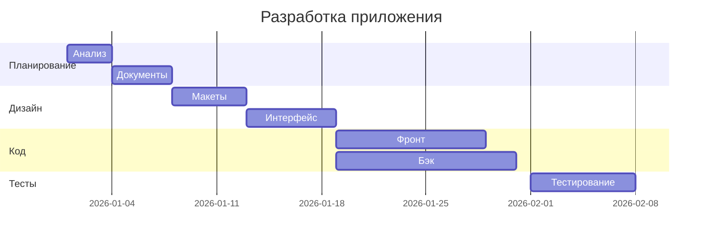
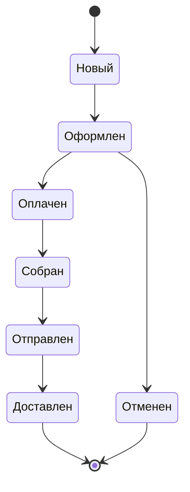
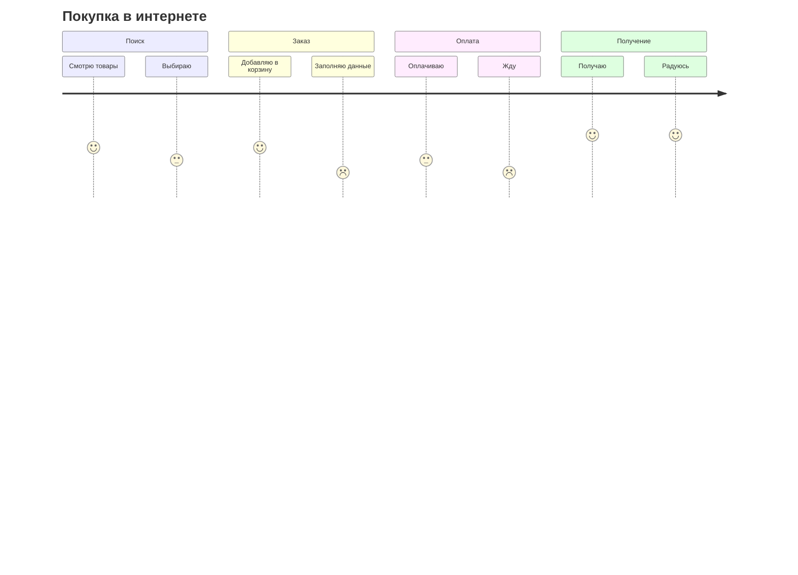
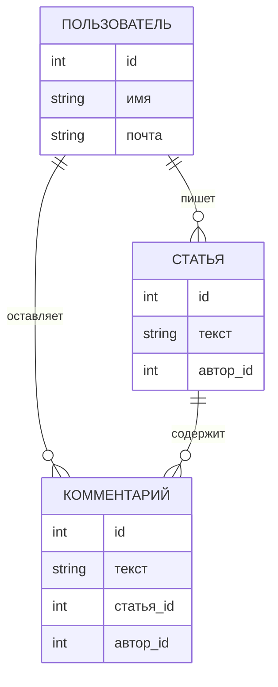
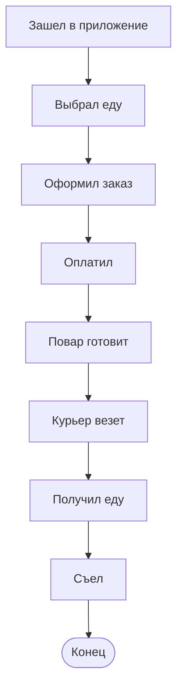
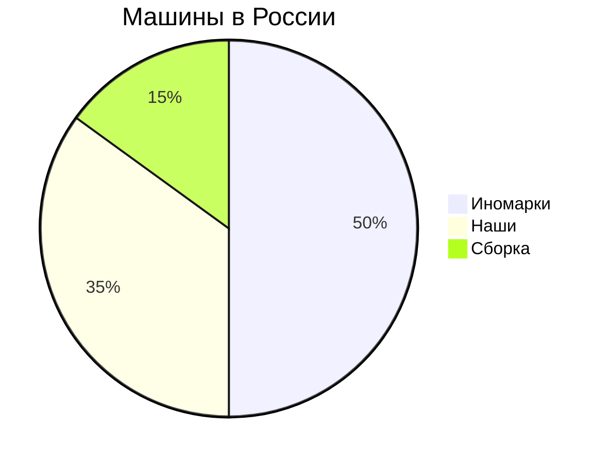

```markdown
# Диаграммы Mermaid

## 1. Блок-схема приготовления чая


## 2. Диаграмма заказа такси


## 3. Диаграмма классов библиотеки


## 4. Диаграмма Ганта разработки


## 5. Архитектура веб-приложения
```mermaid
graph TB
    Пользователь --> Браузер
    Браузер --> Фронтенд
    Фронтенд --> Бэкенд
    Бэкенд --> БазаДанных
    Бэкенд --> Платежи
    Бэкенд --> Почта
    Фронтенд -->[HTML/CSS/JS] Браузер
```

## 6. Диаграмма состояний заказа


## 7. Карта пути пользователя


## 8. ER-диаграмма сайта


## 9. Блок-схема доставки еды


## 10. Круговая диаграмма рынка авто

